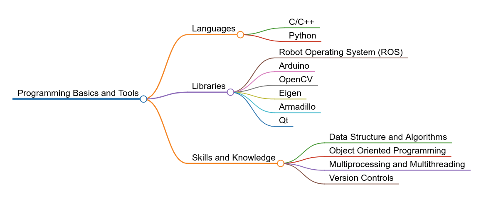
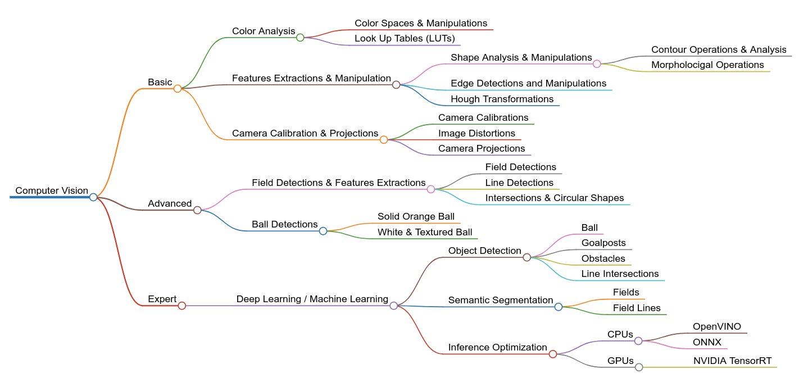
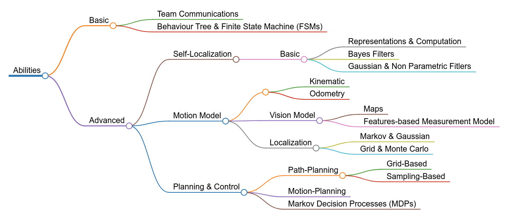

# Sepakbola Humanoid Roadmap

A curated list of references for Indonesian students interested in developing Humanoid Soccer Robot.
---

# Table of Contents 
| <!-- -->                                    | <!-- -->                    | <!-- -->                    | <!-- -->                    |
| ------------------------------------------- | --------------------------- | --------------------------- | --------------------------- |
| [Programming Basic and Tools](#programming) | [Books](#programming-books) | <!-- -->                    | [Codes](#programming-codes) |
| [Computer Vision](#computer-vision)         | [Books](#cv-books)          | [Papers](#cv-papers)        | [Codes](#cv-codes)          |
| [Motion](#motion)                           | [Books](#motion-books)      | [Papers](#motion-papers)    | [Codes](#motion-codes)      |
| [Abilities](#abilities)                     | [Books](#abilities-books)   | [Papers](#abilities-papers) | [Codes](#abilities-codes)   |

# Programming Basic and Tools

Languages :
- C/C++
- Python

Libraries:
- [Robot Operating System (ROS)](https://www.ros.org/)
- [Arduino](https://www.arduino.cc/)
- [OpenCV](https://opencv.org/)
- [Eigen](https://eigen.tuxfamily.org/)
- [Armadillo](http://arma.sourceforge.net/)
- [Qt](https://www.qt.io/)

Skills and Knowledge:
- Data Structure and Algorithms
- Object Oriented Programming
- Multiprocessing and Multithreading

## Books :books:
- Introduction to Algorithms

## Codes :computer:

# Computer Vision

## Books :books:

## Papers :page_facing_up:

## Codes :computer:

# Motion

## Books :books:
- Introduction to Humanoid Robotics
- Robotics - Modelling, Planning, and Control

## Papers :page_facing_up:

## Codes :computer:
- [s-kajita/IntroductionToHumanoidRobotics](https://github.com/s-kajita/IntroductionToHumanoidRobotics)
- [AtsushiSakai/PythonRobotics](https://github.com/AtsushiSakai/PythonRobotics)
- 

# Abilities

## Books :books:
- [Probabilistic Robotics](http://www.probabilistic-robotics.org/)
- [Planning Algorithms](http://lavalle.pl/planning/)

## Papers :page_facing_up:

## Codes :computer:
- [AtsushiSakai/PythonRobotics](https://github.com/AtsushiSakai/PythonRobotics)

# Awesome Open Source Repositories
- [Rhoban](https://github.com/Rhoban)
- [Rhoban Projects](https://github.com/RhobanProject)
- [NUbots](https://github.com/NUbots/NUbots) - The NUbots codebase 
- [bit-bots](https://github.com/bit-bots) - Official Github account of Hamburg Bit-Bots
- [bit-bots/wolfgang_robot](https://github.com/bit-bots/wolfgang_robot) - Open Source Wolfgang-OP robot
- [fumanoids/mitecom](https://github.com/fumanoids/mitecom) - Mixed Team Communication protocol 

