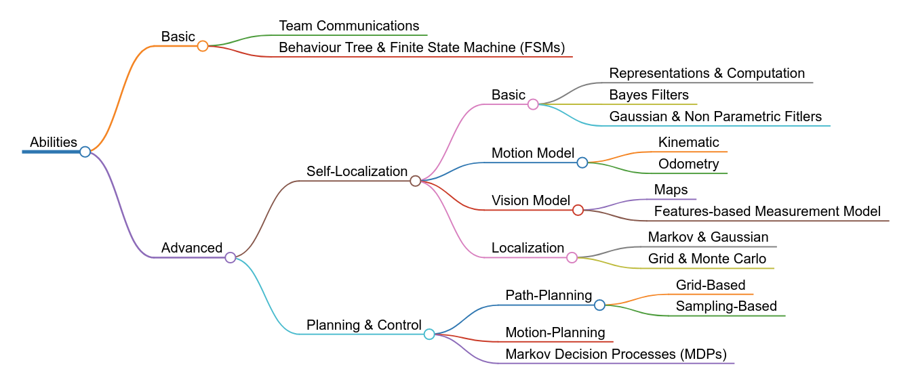

# Sepakbola Humanoid Roadmap

A curated list of references for Indonesian students interested in developing Humanoid Soccer Robot.
---

# Table of Contents 
| <!-- -->                                    | <!-- -->                    | <!-- -->                    | <!-- -->                    |
| ------------------------------------------- | --------------------------- | --------------------------- | --------------------------- |
| [Programming Basic and Tools](#programming) | [Books](#programming-books) | <!-- -->                    | [Codes](#programming-codes) |
| [Computer Vision](#computer-vision)         | [Books](#cv-books)          | [Papers](#cv-papers)        | [Codes](#cv-codes)          |
| [Motion](#motion)                           | [Books](#motion-books)      | [Papers](#motion-papers)    | [Codes](#motion-codes)      |
| [Abilities](#abilities)                     | [Books](#abilities-books)   | [Papers](#abilities-papers) | [Codes](#abilities-codes)   |

# Programming Basic and Tools

Languages :
- C/C++
- Python

Libraries:
- [Robot Operating System (ROS)](https://www.ros.org/)
- [Arduino](https://www.arduino.cc/)
- [OpenCV](https://opencv.org/)
- [Eigen](https://eigen.tuxfamily.org/)
- [Armadillo](http://arma.sourceforge.net/)
- [Qt](https://www.qt.io/)

Skills and Knowledge:
- Data Structure and Algorithms
- Object Oriented Programming
- Multiprocessing and Multithreading

## Books :books:
- [Introduction to Algorithms](https://mitpress.mit.edu/books/introduction-algorithms-third-edition)

## Codes :computer:
- [ROS Tutorials](http://wiki.ros.org/ROS/Tutorials)
- [Qt Examples And Tutorials](https://doc.qt.io/qt-5/qtexamplesandtutorials.html)
- [OpenCV Tutorials](https://docs.opencv.org/master/d9/df8/tutorial_root.html)

# Computer Vision

## Books :books:

## Papers :page_facing_up:
- [A Monocular Vision System for Playing Soccer in Low Color Information Environments](https://www.researchgate.net/publication/327979849_A_Monocular_Vision_System_for_Playing_Soccer_in_Low_Color_Information_Environments)
- [A New Efficient Real-Time Arbitrary Colored Ball Recognition Method for a Humanoid Soccer Robot](https://ieeexplore.ieee.org/document/7578389)
- [An Open Source Vision Pipeline Approach for RoboCup Humanoid Soccer](https://robocup.informatik.uni-hamburg.de/wp-content/uploads/2019/06/vision_paper.pdf)
- [Ball localization for robocup soccer using convolutional neural networks](https://robocup.informatik.uni-hamburg.de/wp-content/uploads/2016/06/speck_Ball_Localization_Robocup_Soccer_Convolutional_Neural_Networks.pdf)
- [The Deep learning Development for Real-Time Ball and Goal Detection of Barelang-FC](https://ieeexplore.ieee.org/document/8240393)
- [TORSO-21 Dataset: Typical Objects in RoboCup Soccer 2021](https://www.researchgate.net/publication/352384714_TORSO-21_Dataset_Typical_Objects_in_RoboCup_Soccer_2021)
- [Towards Real-Time Ball Localization using CNNs](https://robocup.informatik.uni-hamburg.de/wp-content/uploads/2018/06/2018_Speck_Ball_Localization.pdf)

## Codes :computer:

# Motion

## Books :books:
- [Introduction to Humanoid Robotics](https://link.springer.com/book/10.1007/978-3-642-54536-8)
- [Robotics - Modelling, Planning, and Control](https://www.springer.com/gp/book/9781846286414)

## Papers :page_facing_up:
- [A hybrid walk controller for resource-constrained humanoid robots](http://www.romela.org/wp-content/uploads/2015/05/2013_a_hybrid_walk_controller_for_resource-constrained_humanoid_robots.pdf)
- [Balanced Walking with Capture Steps](https://www.ais.uni-bonn.de/papers/RoboCup_2014_Missura_Capture_Steps.pdf)
- [Capture Steps: Robust Walking for Humanoid Robots](https://www.ais.uni-bonn.de/papers/IJHR_2020_Missura.pdf)
- [Development of a full-sized bipedal humanoid robot utilizing spring assisted parallel four-bar linkages with synchronized actuation](http://www.romela.org/wp-content/uploads/2015/05/Development-of-a-full-sized-bipedal-humanoid-robot-utilizing-spring-assisted-parallel-four-bar-linkages-with-synchronized-actuation.pdf)
- [Development of an omnidirectional walking engine for full-sized lightweight humanoid robots](http://www.romela.org/wp-content/uploads/2015/05/Development-of-an-omnidirectional-walking-engine-for-full-sized-lightweight-humanoid-robots.pdf)
- [Fused Angles: A Representation of Body Orientation for Balance](https://www.ais.uni-bonn.de/papers/IROS_2015_Allgeuer.pdf)
- [Learning full body push recovery control for small humanoid robots](http://www.romela.org/wp-content/uploads/2015/05/Learning-full-body-push-recovery-control-for-small-humanoid-robots.pdf)
- [Omnidirectional Bipedal Walking with Direct Fused Angle Feedback Mechanisms](https://www.ais.uni-bonn.de/papers/Humanoids_2016_Allgeuer.pdf)
- [Omnidirectional Capture Steps for Bipedal Walking](https://www.ais.uni-bonn.de/papers/Humanoids_2013_Missura_Omnidirectional_Capture_Steps.pdf)
- [Omnidirectional Walking Using ZMP and Preview Control for the NAO Humanoid Robot](https://link.springer.com/chapter/10.1007/978-3-642-11876-0_33)
- [Online learning of a full body push recovery controller for omnidirectional walking](http://www.romela.org/wp-content/uploads/2015/05/Online-learning-of-a-full-body-push-recovery-controller-for-omnidirectional-walking.pdf)
- [Practical bipedal walking control on uneven terrain using surface learning and push recovery](http://www.romela.org/wp-content/uploads/2015/05/Practical-bipedal-walking-control-on-uneven-terrain-using-surface-learning-and-push-recovery.pdf)
- [Walking Control Algorithm of Biped Humanoid Robot on Uneven and Inclined Floor](https://link.springer.com/article/10.1007/s10846-006-9107-8)
- [Whole-Body Balancing Walk Controller for Position Controlled Humanoid Robots](https://www.semanticscholar.org/paper/Whole-Body-Balancing-Walk-Controller-for-Position-Yi-Zhang/455fdbad547d3a00378203c52cc9e2baec4fcac9)

## Codes :computer:
- [s-kajita/IntroductionToHumanoidRobotics](https://github.com/s-kajita/IntroductionToHumanoidRobotics)
- [AtsushiSakai/PythonRobotics](https://github.com/AtsushiSakai/PythonRobotics)

# Abilities

## Books :books:
- [Probabilistic Robotics](http://www.probabilistic-robotics.org/)
- [Planning Algorithms](http://lavalle.pl/planning/)

## Papers :page_facing_up:
- [Effective Localization of Humanoid with Fish-Eye Lens Using Field Line Detection](https://ieeexplore.ieee.org/document/7556191)
- [Fast and Robust Edge-Based Localization in the Sony Four-Legged Robot League](https://link.springer.com/chapter/10.1007/978-3-540-25940-4_23)
- [Feature-Based Monte Carlo Localization in the RoboCup Humanoid Soccer League](https://tams.informatik.uni-hamburg.de/publications/2019/MSc_Judith_Hartfill.pdf)
- [Feature Detection and Localization for the RoboCup Soccer SPL](https://www.semanticscholar.org/paper/Feature-Detection-and-Localization-for-the-RoboCup-Gudi-Kok/9e2d9d70a228059e8c862c3f4f6677e00f13909d)
- [Monte Carlo Localization for Robocup 3D Soccer Simulation League](https://fei.edu.br/brahur2016/artigos/Artigo%209%20-%20ITA.pdf)
- [Monte Carlo Localization with Field Lines Observations for Simulated Humanoid Robotic Soccer](https://ieeexplore.ieee.org/abstract/document/7783549)
- [Utilizing the Structure of Field Lines for Efficient Soccer Robot Localization](https://www.ais.uni-bonn.de/papers/RoboCup_Symposium_2010_Schulz.pdf)
- [Vision-based Monte-Carlo Localization for Humanoid Soccer Robots](https://ieeexplore.ieee.org/document/8215310)

## Codes :computer:
- [AtsushiSakai/PythonRobotics](https://github.com/AtsushiSakai/PythonRobotics)
- [haritsahm/monte-carlo-localization](https://github.com/haritsahm/monte-carlo-localization)
- 
# Awesome Open Source Repositories
- [Rhoban](https://github.com/Rhoban)
- [Rhoban Projects](https://github.com/RhobanProject)
- [NUbots](https://github.com/NUbots/NUbots) - The NUbots codebase 
- [bit-bots](https://github.com/bit-bots) - Official Github account of Hamburg Bit-Bots
- [bit-bots/wolfgang_robot](https://github.com/bit-bots/wolfgang_robot) - Open Source Wolfgang-OP robot
- [fumanoids/mitecom](https://github.com/fumanoids/mitecom) - Mixed Team Communication protocol 

